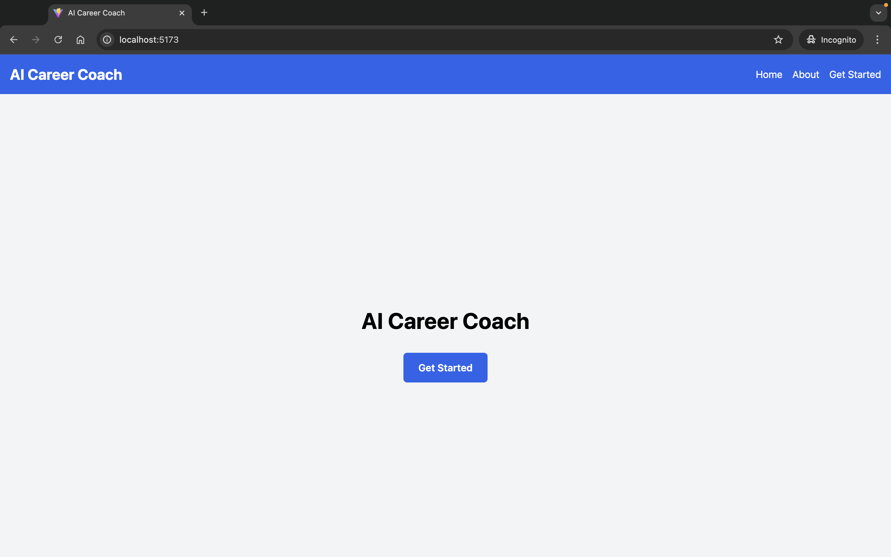

# AI Career Coach

---

### Hackathon Project - Winner (Best use of AI)

### [Hack Knight 2024](https://hack-knight.devpost.com/) (Queens College CUNY Hackathon)

---

**Devpost:** [https://devpost.com/software/ai-career-coach-8c3uzs](https://devpost.com/software/ai-career-coach-8c3uzs)

**Back-End Repo:** [https://github.com/AhnafAhmed13/AI-Resume-builder](https://github.com/AhnafAhmed13/AI-Resume-builder)

### Team (Nested Loops)

- Ahnaf Ahmed | [GitHub](https://github.com/AhnafAhmed13) | [LinkedIn](https://www.linkedin.com/in/ahnafahmed13/)
- Vishal Romel Charran | [GitHub](https://github.com/VishalRomel) | [LinkedIn](https://www.linkedin.com/in/vishal-romel-c-36b1221bb/)
- Yousuf Ahmed | [GitHub](https://github.com/Yahmed99) | [LinkedIn](https://www.linkedin.com/in/yousuf-ahmed-840219256/)
- Mubashirul Islam | [GitHub](https://github.com/saf1Hckr) | [LinkedIn](https://www.linkedin.com/in/mubashirul-islam1606/)

---

### Tech Stack

- **Front-End:** React, Tailwind CSS
- **Back-End:** Python, Flask
- **Database:** Milvus Vector Database
- **API:** OpenAI

---

### Features

- **Customized Resume & Cover Letter Builder:** Users can generate resumes tailored to specific job roles and descriptions.
- **Interview Preparation:** Offers tips and resources to help users prepare for interviews.
- **Best Job Matches:** Provides real-time job postings that matches the user's profile.

---

AI Career Coach analyzes users’ uploaded resumes, GitHub, LinkedIn profiles, and portfolio links to provide personalized career tools. These tools include generating optimized resumes and cover letters for specific job postings, offering interview preparation tips, and identifying strengths and weaknesses, along with real-time job postings that matches with the user's profile. By focusing on these areas, AI Career Coach helps users present themselves in the best possible light, increasing their chances of landing their desired job.

---

### Workflow

The front end, built with **React** and **Tailwind CSS**, delivers an intuitive and interactive user experience, while the back end, powered by **Flask**, handles data processing, web scraping, and API integration. Using **React Hook Form**, user inputs such as resume files, GitHub, LinkedIn, and portfolio links are collected and sent to the back end. Once received, Flask processes and analyzes these inputs utilizing the **Milvus vector database** and **OpenAI APIs**, supplemented by web scraping to retrieve additional relevant information about specific job postings. This robust data processing enables personalized, data-driven recommendations for each user. Furthermore, Flask manages file uploads and dynamically generates **customized PDF resumes** and **cover letters**, providing users with a seamless, end-to-end career optimization tool.

---

### Screenshots

